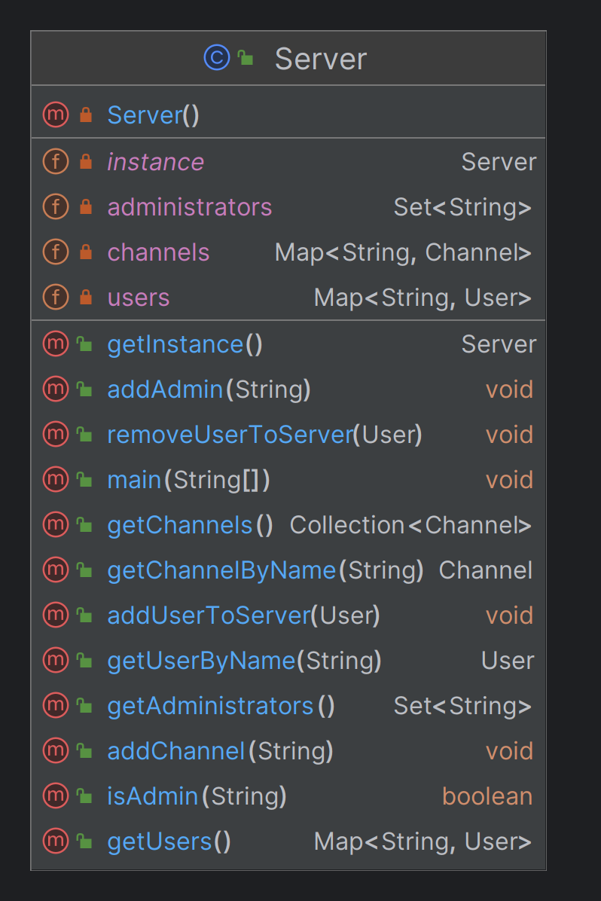
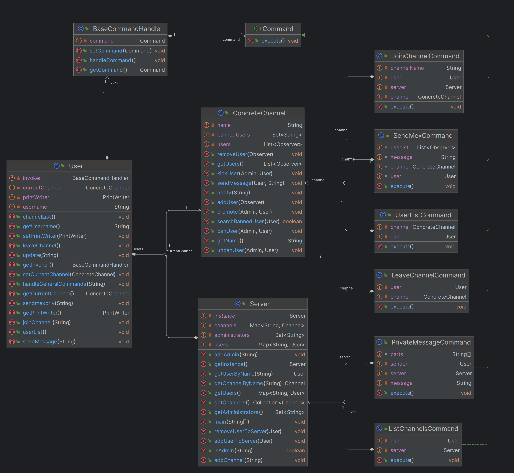
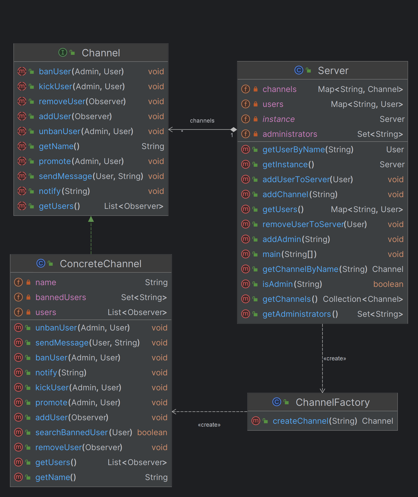
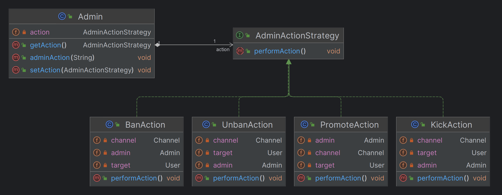
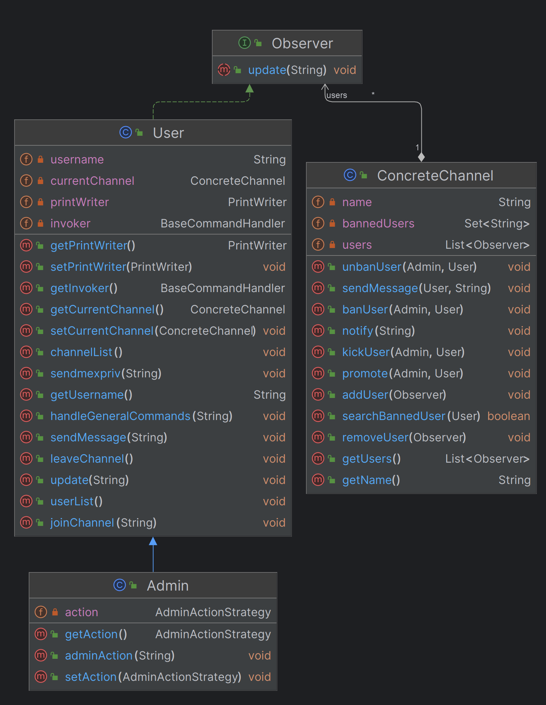

# IRC-p3proj
<a name="readme-top"></a>
<!-- PROJECT SHIELDS -->
[](./LICENSE)
![GitHub][GitHub.com]

<!-- PROJECT LOGO -->
<br />
<div align="center">
  <a href="https://github.com/checcafor/IRC-p3proj">
    
  </a>

  <h3 align="center">IRC Chat</h3> 
  <br>

  <p align="center">
    Progetto di programmazione 3 (6 CFU)
    <br />
    A.A. 2023/24
    <br>

  </p>
</div>

<!-- Traccia -->
# Traccia
Simulare una chat multiutente	basata su IRC. Utilizzare un approccio client/server.<br>

### Server:
* Permette agli utenti di connettersi
* Mostra agli utenti una serie di possibili canali attivi (identificati con #)
* Rappresenta un gruppo in cui tutti gli utenti connessi possono inviare messaggi visibili a tutti coloro che sono connessi in quel canale
* Permette all'utente di cambiare il canale su cui è connesso
* Gestisce la collisione tra nomi utenti uguali
* Permette a due utenti di parlare in privato

### Client:
* Si connette ad un server specificando un nome utente, non è richiesta la password
* Può richiedere la lista dei canali inviando
  * Comando: `/list`
* Può connettersi ad un canale
  * Comando: `/join #channel_name`
* Può vedere gli utenti connessi
  * Comando: `/users`
* Può inviare messaggi
  * Comando `/msg messaggio`
* Può inviare un messaggio privat ad un utente
  * Comando: `/privmsg nickname messaggio`
* Può cambiare il canale su cui è connesso in qualunque momento

Implementare l'utente <i><b>amministratore</b></i> che può:
* Espellere un utente dal canale:
  * Comando: `/kick nickname`
* Bannare/sbannare un utente dal canale:
  * Comando: `/ban nickname`
  * Comando: `/unban nickname`
* Promuovere un utente come moderatore:
  * Comando: `/promote nickname`

<!-- ABOUT THE PROJECT -->
## About The Project

<div style="text-align: justify">
   La seguente proposta per il progetto di Programmazione 3 è un'applicazione di chat IRC scritta
   in Java, con un focus particolare sull'archiviazione dei log delle conversazioni su un database
   utilizzando JDBC. <br> Questo progetto offre un'esperienza completa di sviluppo in Java, includendo
   la gestione delle connessioni di rete (tramite architettura client/server), l'interfacciamento 
   con un database relazionale e la generazione automatica della documentazione attraverso Javadoc.
   Il progetto include, inoltre,  l'implementazione di 5 design pattern per migliorare l'organizzazione, la manutenibilità e la scalabilità del codice.
</div>
<p align="right">(<a href="#readme-top">back to top</a>)</p>

<!-- BUILD WITH -->
## Built With

### Back and Front:


### DB Support:


<p align="right">(<a href="#readme-top">back to top</a>)</p>

<!-- PROJECT STRUCTURE -->
## Project Structure

Di seguito è riportata la struttura gerarrchica della divisione in package dei moduli in base ai pattern utilizzati.

```bash
   📦 IRC chat
    ├─ src
    │  ├─ 🔌 dbconnector
    │  │  ├─ DatabaseConnector.java
    │  │  ├─ DataToDatabase.java
    │  │  └─ RetrieveDataFromDatabase.java
    │  ├─ ⚙️ patterns
    │  │  ├─ COMMAND
    │  │  │  ├─ BaseCommandHandler.java
    │  │  │  ├─ Command.java
    │  │  │  ├─ JoinChannelCommand.java
    │  │  │  ├─ LeaveChannelCommand.java
    │  │  │  ├─ ListChannelCommand.java
    │  │  │  ├─ PrivateMessageCommand.java
    │  │  │  ├─ SendMexCommand.java
    │  │  │  └─ UserListCommand.java
    │  │  ├─ FACTORY-PATTERN
    │  │  │  ├─ Channel.java
    │  │  │  └─ ChannelFactory.java
    │  │  ├─ OBSERVER
    │  │  │  ├─ ConcreteChannel.java
    │  │  │  ├─ Observer.java
    │  │  │  └─ User.java
    │  │  ├─ SINGLETON
    │  │  │  └─ Server.java
    │  │  └─ STRATEGY
    │  │     ├─ Admin.java
    │  │     ├─ AdminActionStrategy.java
    │  │     ├─ BanAction.java
    │  │     ├─ KickAction.java
    │  │     ├─ PromoteAction.java
    │  │     └─ UnbanAction.java
    │  └─ 📲 GUI
    │     ├─ ChatClient.java
    │     └─ IRCChatApp.java
    ├─ .gitignore
    ├─ LICENSE
    └─ README.md
```

<p align="right">(<a href="#readme-top">back to top</a>)</p>

<!-- PATTERNS -->
## Pattern Used

| Descrizione del Pattern                                                                                                             | Schema                                                                              |
|-------------------------------------------------------------------------------------------------------------------------------------|-------------------------------------------------------------------------------------|
| <b>Singleton</b><br/>utilizzato per l'unica istanza del server                                                                      | <center></center>          |
| <b>Command</b><br/>utilizzato per implementare i singoli comandi utente (quelli di base, e comuni anche ad admin)                   | <center></center>         |
| <b>Factory Pattern</b><br/> utilizzato per la creazione di canali. Utilizzato in quanto si ha solo una tipologia di canali          | <center></center> |
| <b>Strategy</b><br/> utilizzato per implementare i comandi riservati agli Admin                                                     | <center></center>        |
| <b>Observer</b><br/> utilizzato per gestire la distribuzione degli eventi nei canali, come messaggi normali, e quelli di "notifica" | <center></center>        |

<p align="right">(<a href="#readme-top">back to top</a>)</p>

<!-- STARTING THE APPLICATION -->
## Starting the Application

1. Eseguire per prima cosa il server, che si trova al seguente percorso: `src/patterns/singleton/Server.java`
2. Eseguire più istanze del cliente, che si trova al seguente percorso: `src/GUI/IRCChatApp.java`
3. Inserire quindi tramite l'interfaccia appena aperta un nome utente (che deve essere univoco) per accedere al server
4. Iniziare a mesaggiare!

<!-- LICENSE -->
## License
> [!WARNING]
> Distributed under the `MIT License`. See <a href="https://github.com/checcafor/IRC-p3proj/blob/main/LICENSE">LICENSE</a> for more information.
<p align="right">(<a href="#readme-top">back to top</a>)</p>

<!-- CONTACT -->
## Contact
> [!NOTE]
> De Micco Francesco - [linkedin](https://www.linkedin.com/in/francesco-de-micco-b55034210/) - francesco.demicco001@studenti.uniparthenope.it <br>
> Formisano Francesca - [linkedin](https://www.linkedin.com/in/francesca-formisano-056460263/) - francesca.formisano001@studenti.uniparthenope.it <br>
>
> Project Link: [https://github.com/checcafor/IRC-p3proj.git](https://github.com/checcafor/IRC-p3proj.git)

<p align="right">(<a href="#readme-top">back to top</a>)</p>

<!-- MARKDOWN LINKS & IMAGES -->
[GitHub.com]: https://img.shields.io/badge/github-%23121011.svg?style=for-the-badge&logo=github&logoColor=white
